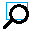

# leaflet.marker.pin

Pins for leaflet are markers that can be added, edited or deleted directly on the map from the web page. 

## How it's work on the map

Go to the [demo](http://wwwouaiebe.github.io/leaflet.marker.pin/) page.

### Adding a pin.

Click ( with the left or right button ) somewhere on the map.
Complete the opened window with the data you will have in the marker and choose a category. Finish with the OK button. A marker is added to the map.

### Geolocalization ###

When a pin is created a geolocalization is performed with [Nominatim](http://wiki.openstreetmap.org/wiki/Nominatim). The precision is depending of the zoom factor on the map.

### View the data on the map

Left click on the pin. A popup is showed with the entered data.

### Editing a pin.

Right click on the pin and select **Edit this pin** in the context menu. The same dialog than for a new pin is displayed and you can change the data or the category.

### Removing a pin

Right click on the pin and select **Delete this pin** in the context menu.

### Moving a pin

Pins can be dragged on the map.

### Using the control

## Zoom on the pins

Use the button  to zoom on the pins

##View or hide the control

Use the buttons  
 or  to open or close the control.

##Extend or reduce the size of the control

Use the buttons  and 

## Zoom to a pin from the control

Right or left click on a pin description in the control to zoom on the pin.

## Edit a pin from the control

Double click on a pin description in the control to zoom on the pin and start the editor.

## Reorder the pins

Drag and drop the pin description in the control to reorder the pins.

### Display a page with the pins description

The 'View' button on the left opens a new page with the pins description. This page is updated each time a pin is modified, added or deleted.

## What's you have to do in your html page?

First have a look on the demo source page:
```
<!DOCTYPE html>
<html>
	<head>
		<meta charset="UTF-8" />
		<title>leaflet.marker.pin by wwwouaiebe</title>
		<link rel="stylesheet" href="leaflet.css" />
		<link rel="stylesheet" href="L.Marker.Pin.css" />
	</head>
	<body>
		<div id="Map">
		</div>
		<script src="leaflet.js"></script>
		<script src="L.Marker.Pin.min.js"></script>
		<script>
			(function() 
			{
				'use strict';

				var myInterface = L.marker.pin.interface ( );
				
				myInterface.UserLanguage = 'en';
				
				myInterface.addDefaultCategories ( );
				
				myInterface.setCallbackFunction ( function ( ) { history.pushState ( { index : "bar" } , "page", '?pin=' + myInterface.stringifyPins ( ) );	});

				var Map = L.map ( 'Map' ).setView( [ 50.49680, 5.51116 ], 13 );
				L.tileLayer ( 'http://{s}.tile.osm.org/{z}/{x}/{y}.png', { attribution: '&copy; <a href="http://www.openstreetmap.org/copyright" title="Contributeurs de OpenStreetMap">Contributeurs de OpenStreetMap</a> | &copy; <a href="http://www.ouaie.be/" title="http://www.ouaie.be/">Christian Guyette</a>' } ).addTo ( Map );

				Map.on ( 'click', function ( Event ) { myInterface.newPin ( Map, Event.latlng )} );
				Map.on ( 'contextmenu', function ( Event ) { myInterface.newPin ( Map, Event.latlng )} ); 

				myInterface.addControl( Map, { position : 'topright' } );

				var Search = decodeURI ( window.location.search );
				if ( 0 <= Search.indexOf ( 'pin=' ) ) { myInterface.parsePins ( Search.substr ( Search.indexOf ( 'pin=' ) + 4 ), Map );}
			}
			());		
		</script>
	</body>
</html>
```

### Loading Leaflet

You need to have Leaflet loaded before using leaflet.marker.pin. 

In the head of the html file you have to load the *leaflet.css* style sheet...
```
		<link rel="stylesheet" href="leaflet.css" />
```
... and in the head or the body load the *leaflet.js* JavaScript code.
```
		<script src="leaflet.js"></script>
```
Notice that leaflet is not provided with this project. You have to download Leaflet from [leafletjs.com](http://leafletjs.com/).

### Loading leaflet.marker.pin

In the same way you have loaded leaflet, you have now to load leaflet.marker.pin.

In the head of the html file you have to load the *L.Marker.Pin.css* style sheet...
```
		<link rel="stylesheet" href="L.Marker.Pin.css" />
```
... and in the head or the body load the *L.Marker.Pin.min.js* JavaScript code.
```
		<script src="L.Marker.Pin.min.js"></script>
```

## What's you have to do in your JavaScript?

All the interaction is performed with a single instance of the object L.Marker.Pin.Interface. An instance of this object can
be accessed with the function L.marker.pin.interface ( ). 

The L.marker.pin.interface ( ) is based on the singleton pattern, so the function returns always the same instance. You can save this instance
in a variable, but it's not mandatory.

### Language settings

Currently L.Marker.Pin is translated in French, Dutch and English. The default language is French, so if you will
use another language, you have first to change the default language.
```
L.marker.pin.interface ( ).UserLanguage = 'en';
```

For others languages than fr, nl or en, use first the addTranslation ( ) method .
```
L.marker.pin.interface ( ).addTranslation ( 'L.Marker.Pin.Address',  'de', 'Lorem ipsum...' );
```

### Using addTranslations and getText to translate messages used outside L.marker.pin

You can use the translation mechanism in L.marker.pin to translate others messages used in your own code.

### Categories

You have also to say with witch categories you will work. 28 categories are currently defined, but perhaps you are not happy 
with these categories or associated icons. In this case, you can create your own categories.

#### Using the 28 default categories

The function addDefaultCategories ( ) is used to add the 28 categories already configured in L.Marker.Pin.
```
L.marker.pin.interface ( ).addDefaultCategories ( );
```

#### Adding your own categories

Use the function addCategory ( ) to add a new category.
```
L.marker.pin.interface ( ).addCategory ( CategoryId, CategoryNames, CategoryIcon );
```

### Adding a callback method that is called each time a pin is created, edited, deleted or moved

With this method, you can add your own method that is called each time a pin is created, edited, deleted or moved.
On the demo page, this function is used to save the pins in the search part of the URL
```
L.marker.pin.interface ( ).setCallbackFunction ( CallbackFunction );
```

### Adding a pin

You have also to decide how the user can add a pin on the map: by a left or right click on the map, from a menu or everything you will, but 
finally you have to call the newPin ( method ) to add the pin.
```
L.marker.pin.interface ( ).newPin ( Map, Event.latlng );
```

### Persistence

It's nice to add pins on the map, but probably you will share the pins with other people, so you have to implement persistence.
In the demo it's done trough the URL, but you can imagine others ways: cookies, files, databases...
To implement the persistence, you have to use two methods, one for saving the pins and one for restoring the pins.
Saving the pins is performed with the stringifyPins ( ) method. This method returns a JSON string with the data of all the pins that are on the map:

```
L.marker.pin.interface ( ).stringifyPins ( );
```

And restoring the pins is done by passing the JSON string given by the stringifyPins ( ) method to the parsePins ( ) method:
```
L.marker.pin.interface ( ).parsePins ( PinsJsonString, Map );
```

## L.Marker.Pin.Interface object documentation

### L.marker.pin.interface ( ) function

the L.marker.pin.interface ( ) function returns a unique instance of the L.Marker.Pin.Interface object.

### addCategory ( CategoryId, CategoryNames, CategoryIcon ) method 

This method add a new category

Parameters:

- CategoryId : a unique identifier for the category. It's impossible to add a new category
when another category uses already this unique identifier. Default categories are using '01' to '28'
as unique identifiers. It's better to not use values between '29' and '99' to avoid problems with 
new default categories in the future.

- CategoryNames : the names of the category in the different languages.
Must be an object like this: { 'en' : 'Lorem ipsum', 'fr' : 'dolor sit amet', 'nl' : 'consectetur adipiscing', }

- CategoryIcon : a L.Icon or L.DivIcon object used as icon for the pins created with this category

Sample of code using a L.Icon and the leaf-red.png provided in the [leaflet tutorials](http://leafletjs.com/examples/custom-icons.html)

```
myInterface.addCategory ( 
	'IconCategory', 
	{ 'en' : 'Leaflet red', 'fr' : 'Leaflet rouge', 'nl' : 'Leaflet rood' }, 
	L.icon( {
		iconUrl: 'leaf-red.png',
		shadowUrl: 'leaf-shadow.png',
		iconSize:     [38, 95],
		shadowSize:   [50, 64],
		iconAnchor:   [22, 94],
		shadowAnchor: [4, 62],
		popupAnchor:  [-3, -76]
	} ) );					
```

Sample of code using a L.Icon and the leaf-orange.png provided in the [leaflet tutorials](http://leafletjs.com/examples/custom-icons.html)
```

myInterface.addCategory ( 
	'DivIconCategory', 
	{ 'en' : 'Category with L.DivIcon sample', 'fr' : 'Exemple de catégorie avec L.DivIcon' }, 
	L.divIcon ( { 
		iconSize: [220, 150], 
		iconAnchor: [110, 75], 
		popupAnchor: [0, -10], 
		html : '<div style="text-align: center"><br />Category made with L.DivIcon</div>'
	} ) );
```

### addDefaultCategories ( ) method

This method add the 28 categories included in L.Marker.Pin
		
### addTranslation ( TextId, Language, Translation ) method

This method add a translation for a text in the user interface. It's impossible to add a translation when the unique identifier is not present
or when the translation exists already for this identifier and language

Parameters:

- TextId : the unique identifier of the text

- Language : the language to be used

- Translation : the translated text 

Return value:

- returns true when the message is added, false otherwise. When false is returned an error message is also displayed in the JavaScript console

Unique identifiers currently used:

- for the popup: 'L.Marker.Pin.Address', 'L.Marker.Pin.Phone' and 'L.Marker.Pin.Link'
- for the context menu: 'L.Marker.Pin.ContextMenu.EditPin', 'L.Marker.Pin.ContextMenu.DeletePin' and 'L.Marker.Pin.ContextMenu.CloseMenu'
- for the 'edit pin dialog': 'L.Marker.Pin.EditDialog.PinModification', 'L.Marker.Pin.EditDialog.NewPin', 'L.Marker.Pin.EditDialog.Text',
'L.Marker.Pin.EditDialog.Address', 'L.Marker.Pin.EditDialog.Phone', 'L.Marker.Pin.EditDialog.Link', 'L.Marker.Pin.EditDialog.Category',
'L.Marker.Pin.EditDialog.Ok' and 'L.Marker.Pin.EditDialog.Cancel'
- for the default categories from 01 to 28: 'L.Marker.Pin.Category.01' to 'L.Marker.Pin.Category.28'

```
Sample of translation to a new language:
	
	// ...for the popup ...
	L.marker.pin.interface ( ).addTranslation ( 'L.Marker.Pin.Address',  'de', 'Lorem ipsum...' );
	L.marker.pin.interface ( ).addTranslation ( 'L.Marker.Pin.Phone', 'de', 'Lorem ipsum...' );
	L.marker.pin.interface ( ).addTranslation ( 'L.Marker.Pin.Link', 'de', 'Lorem ipsum...' );
	// ... for the context menu ...
	L.marker.pin.interface ( ).addTranslation ( 'L.Marker.Pin.ContextMenu.EditPin', 'de', 'Lorem ipsum...' );
	L.marker.pin.interface ( ).addTranslation ( 'L.Marker.Pin.ContextMenu.DeletePin', 'de', 'Lorem ipsum...' );
	L.marker.pin.interface ( ).addTranslation ( 'L.Marker.Pin.ContextMenu.CloseMenu', 'de', 'Lorem ipsum...' );
	// ... for the edit pin dialog ...
	L.marker.pin.interface ( ).addTranslation ( 'L.Marker.Pin.EditDialog.PinModification', 'de', 'Lorem ipsum...' );
	L.marker.pin.interface ( ).addTranslation ( 'L.Marker.Pin.EditDialog.NewPin', 'de', 'Lorem ipsum...' );
	L.marker.pin.interface ( ).addTranslation ( 'L.Marker.Pin.EditDialog.Text', 'de', 'Lorem ipsum...' );
	L.marker.pin.interface ( ).addTranslation ( 'L.Marker.Pin.EditDialog.Address', 'de', 'Lorem ipsum...' );
	L.marker.pin.interface ( ).addTranslation ( 'L.Marker.Pin.EditDialog.Phone', 'de', 'Lorem ipsum...' );
	L.marker.pin.interface ( ).addTranslation ( 'L.Marker.Pin.EditDialog.Link', 'de', 'Lorem ipsum...' );
	L.marker.pin.interface ( ).addTranslation ( 'L.Marker.Pin.EditDialog.Category', 'de', 'Lorem ipsum...' );
	L.marker.pin.interface ( ).addTranslation ( 'L.Marker.Pin.EditDialog.Ok', 'de', 'Lorem ipsum...' );
	L.marker.pin.interface ( ).addTranslation ( 'L.Marker.Pin.EditDialog.Cancel', 'de', 'Lorem ipsum...' );	
	// ...for the default categories from 01 ...
	L.marker.pin.interface ( ).addTranslation ( 'L.Marker.Pin.Category.01', 'de', 'Lorem ipsum...' );	
	// ... to 28...
	L.marker.pin.interface ( ).addTranslation ( 'L.Marker.Pin.Category.28', 'de', 'Lorem ipsum...' );	
```

### addTranslations ( TextId, Translations ) method

Parameters:

Parameters:

- TextId : the unique identifier of the text.
- Translations : the translated text. Must be an object like  { 'fr' : 'Rue', 'nl' : 'Straat', 'en' : 'Street' }.

Return value:

- returns true when the text is added.
- returns false when the TextId is already used.

### getText( TextId ) method

This method gives in the user language a text identified by the TextId parameter.

Parameters:

- TextId : the unique identifier of the text

Return value:

- the text identified by TextId in the current user language when found
- the text identified by TextId in 'en' when not found in the current user language
- '???' when the text identified by TextId is not found in the current user language or 'en'
- '???' when TextId is not found


### newPin ( Map, Latlng ) method

This method show the 'edit pin dialog' on the screen and add a pin on the map when the user close the dialog with the 'OK' button.

Parameters:

- Map : the L.Map object to witch the pin will be added

- Latlng : a L.LatLng object with the position on the map where the pin must be added.

### setCallbackFunction ( CallbackFunction ) method

This method changes the function that is called each time a pin is created, deleted, edited or moved.

Parameters:

- CallbackFunction : the function :-)

### stringifyPins ( ) method

This method returns a JSON string with the data present in the pins. This string can be used to restore the pins with the parsePins ( ) method

### parsePins ( PinsJsonString, Map ) method

This method restore the pins on the map based on the JSON string given by the stringifyPins ( ) method

Parameters:

- PinsJsonString: the JSON string with the data

- Map : the L.Map object to witch the pin will be added

### addControl ( Map, options ) method

This method add the pins control to the map.

Parameters:

-  Map : the L.Map object to witch the control will be added

- options the control options. See the leaflet control documentation


### Release property (read only)

This property gives the release number

### UserLanguage property

The language to use.

### PinsHtmlElement property (read only)

This property gives an HTMLElement object with the pins data.

Sample of object returned:

```
<div class ="Pin-Print-Main">
	<div class="Pin-Print-Pin">
		
		</img>
		<div class="Pin-Print-Category">
			Lorem Ipsum...
		</div>
		<div class="Pin-Print-Text">
			dolor sit amet, consectetur adipiscing elit. 
		</div>
		<div class="Pin-Print-Address">
			Sed non risus
		</div>
		<div class="Pin-Print-Phone">
			Suspendisse lectus tortor, dignissim sit amet,
		</div>
		<div class="Pin-Print-Url">
			adipiscing nec, ultricies
		</div>
	</div>
	... next pin...
</div>
```

See also the PinsHtlmlOptions property.

### PinsHtlmlOptions property

The options used for the PinsHtmlElement property

Default value:

```
{
	mainElement : 'div',
	mainClass : "Pin-Print-Main" , 
	pinElement : 'div',
	pinClass : "Pin-Print-Pin" , 
	categoryImgClass : "Pin-Print-CategoryImg",
	categoryElement : 'div',
	categoryClass : "Pin-Print-Category" , 
	textElement : 'div',
	textClass : "Pin-Print-Text" , 
	addressElement : 'div',
	addressClass : "Pin-Print-Address" , 
	phoneElement : 'div',
	phoneClass : "Pin-Print-Phone" , 
	urlElement : 'div',
	urlClass : "Pin-Print-Url" ,
	urlLength : 9999
}
```

## Know limitations and problems

- Browsers have a limited length for the URL, especially IE and Edge. Saving a big collection of pins trough the URL can be difficult. 
- Using non ASCII characters for the translations can gives strange results with IE for Windows Phone 8. No problems encountered with others browsers...
- Drop a pin in the control don't work correctly with IE 11
